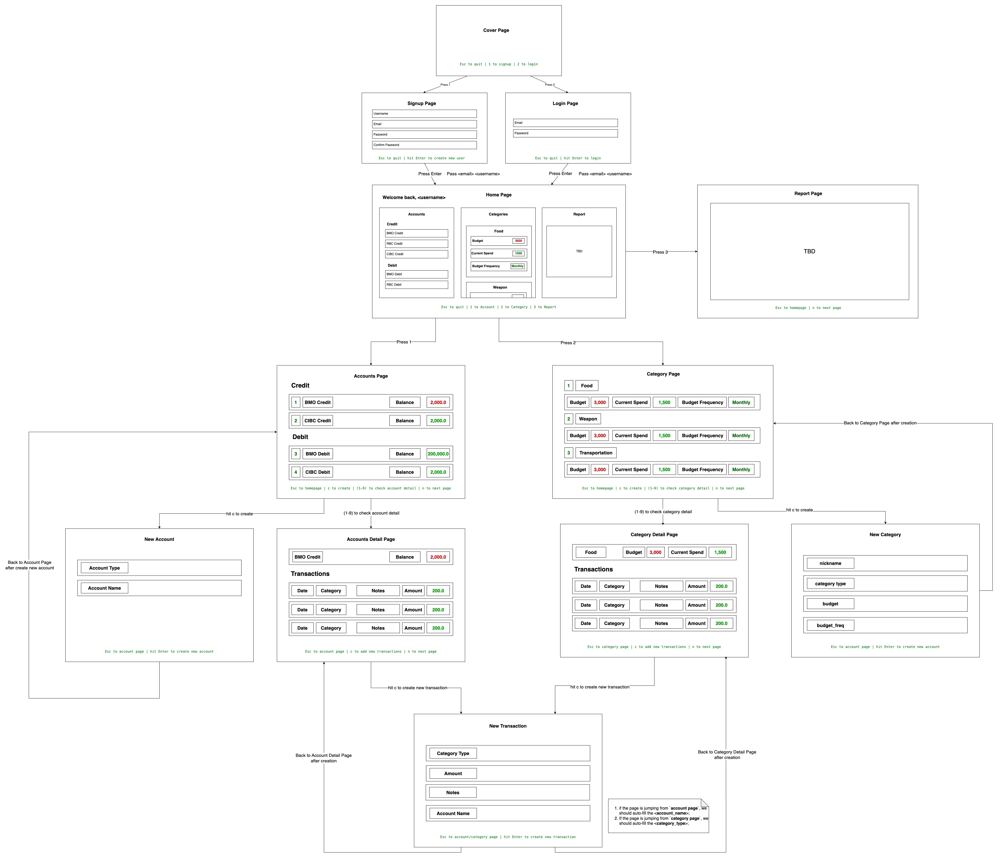

```text
 ______  __  __   __  ______  ______  ______  ______  __  __    
/\  ___\/\ \/\ "-.\ \/\__  _\/\  == \/\  __ \/\  ___\/\ \/ /    
\ \  __\\ \ \ \ \-.  \/_/\ \/\ \  __<\ \  __ \ \ \___\ \  _"-.  
 \ \_\   \ \_\ \_\\"\_\ \ \_\ \ \_\ \_\ \_\ \_\ \_____\ \_\ \_\ 
  \/_/    \/_/\/_/ \/_/  \/_/  \/_/ /_/\/_/\/_/\/_____/\/_/\/_/
```
---

# **📘 TUI Frontend Documentation**

---

## **🗂️ Project Structure**

Here is the **tree view** of the **TUI frontend project**. This structure is designed to keep files organized and make it easy to add new pages, components, and utilities.

```
TUI/
├── Cargo.toml               # Rust package manifest file
├── src/
│   ├── main.rs              # Entry point for the application
│   ├── ui/
│   │   ├── components.rs    # Reusable input field components
│   │   ├── cover.rs         # Cover page (first page of the TUI)
│   │   ├── login.rs         # Login page
│   │   ├── signup.rs        # Signup page
│   │   └── mod.rs           # Exposes all UI pages for easy imports
│   └── utils/               # Utility functions, helpers, or extensions (optional)
│
├── assets/                  # Place for ASCII art or static text files (optional)
├── README.md                # Instructions for the project
└── .gitignore               # Ignore build files, node_modules, etc.
```


## **🗂️ Work Distribution**

| **Page**           | **Assign to** | **Done or Not** |
|-------------------|---------------|-----------------|
| Cover             | Damian        | ✅               |
| Signup            | Damian        |                 |
| Login             | Damian        |                 |
| Home              | Damian        |                 |
| Account           | Ellen         |                 |
| Account Detail    | Ellen         |                 |
| Create Account    | Ellen         |                 |
| Category          | TBD           |                 |
| Category Detail   | TBD           |                 |
| Create Category   | TBD           |                 |
| Create Transaction| Damian        |                 |
| Report            | Sarah         |                 |


---

## **🎨 Page Design**


---

## **📚 Explanation of Key Files**

| **File/Folder**         | **Purpose**                               |
|-----------------------|--------------------------------------------|
| **`main.rs`**          | Entry point of the TUI app, sets up the terminal, and handles page routing. |
| **`ui/cover.rs`**      | First page displayed when the app runs. Shows the logo and page options (Signup, Login, Quit). |
| **`ui/signup.rs`**     | Handles the signup page where users enter their **username, email, password, and confirm password**. |
| **`ui/login.rs`**      | Handles the login page where users enter **email and password** to log in. |
| **`ui/components.rs`** | Defines reusable components like **InputField** for forms (input fields) used on **Signup** and **Login** pages. |
| **`ui/mod.rs`**        | Exports all UI pages (cover, login, signup) so they can be easily imported from `mod.rs`. |
| **`utils/`**           | Utility functions (not required for now but useful if logic grows). |
| **`assets/`**          | Store static files like ASCII logos or help text (optional, can be used for large logos). |

---

## **🌐 Page Workflow**

Here’s how the **flow of pages works** in this project.

```
[ Cover Page (start) ]
      ↓
  [ 1. Signup Page ]  <--- Select using keyboard
      ↓
  [ 2. Login Page ]   <--- Select using keyboard
```

1. **Cover Page**: The first page displayed when you launch the app.
    - You can select **1** to go to the **Signup Page**.
    - You can select **2** to go to the **Login Page**.
    - Press **Esc** to quit.

2. **Signup Page**:
    - User fills in **Username, Email, Password, and Confirm Password**.
    - **Press Tab** to navigate between input fields.
    - **Press Enter** to submit the form.
    - If passwords don't match, an error message appears.

3. **Login Page**:
    - User fills in **Email and Password**.
    - **Press Tab** to navigate between input fields.
    - **Press Enter** to submit the form.
    - If email/password is incorrect, an error message appears.

---

## **🔧 How to Add a New Page**

To add a new page, follow this **step-by-step workflow**. Let’s assume you want to add a **Settings Page**.

1. **Create the Page File**:
    - Go to **`src/ui/`**.
    - Create a new file named `settings.rs`.

2. **Add Your Page Logic**:
```rust
   use ratatui::{
       layout::{Constraint, Direction, Layout},
       widgets::{Block, Borders, Paragraph},
       style::{Color, Style},
       Frame,
   };
   
   pub struct SettingsPage;
   
   impl SettingsPage {
       pub fn new() -> Self {
           Self
       }
   
       pub fn render(&self, f: &mut Frame) {
           let chunks = Layout::default()
               .direction(Direction::Vertical)
               .margin(2)
               .constraints([Constraint::Percentage(100)].as_ref())
               .split(f.area());
   
           let title = Paragraph::new("Settings Page")
               .style(Style::default().fg(Color::Yellow))
               .block(Block::default().borders(Borders::ALL));
   
           f.render_widget(title, chunks[0]);
       }
   }
```

3. **Expose the Page in `mod.rs`**:
    - Go to `src/ui/mod.rs`.
    - Add the following line:
```rust
      pub mod settings;
```

4. **Add the Page Route in `main.rs`**:
    - Open `src/main.rs`.
    - Import the new page:
```rust
      use crate::ui::settings::SettingsPage;
```
    - Add a key (like `3`) to **open the Settings Page** from the cover page:
```rust
      match key {
          KeyCode::Char('1') => current_page = Page::Signup,
          KeyCode::Char('2') => current_page = Page::Login,
          KeyCode::Char('3') => current_page = Page::Settings, // New Route for Settings Page
          KeyCode::Esc => break,
          _ => {}
      }
```

---

## **📦 Example `mod.rs` File (for src/ui/mod.rs)**
This file exposes all **UI pages**.

```rust
pub mod components;
pub mod cover;
pub mod signup;
pub mod login;
pub mod settings; // Newly added settings page
```

---

## **🚀 How to Run the App**

1. **Clone the Repo**:
```sh
   git clone https://github.com/username/tui-frontend.git
   cd tui-frontend
```

2. **Run the App**:
```sh
   cargo run
```

3. **Navigate**:
    - **1** to go to the Signup Page.
    - **2** to go to the Login Page.
    - **Esc** to quit.

---

## **📜 Page Descriptions**

| **Page**        | **Description**                                              |
|-----------------|------------------------------------------------------------|
| **Cover Page**   | Main menu, shows logo and options for Signup and Login.     |
| **Signup Page**  | User fills in **username, email, password** and confirms it.|
| **Login Page**   | User enters **email and password** to log in.               |
| **Settings Page**| (Optional) Add options like **theme selection**.            |

---

## **🎉 Contribution Workflow**

1. **Fork the repo** on GitHub.
2. **Create a branch** for your new feature.
```sh
   git checkout -b feature/new-page
```

3. **Add a new page** in `src/ui/` following the workflow above.
4. **Run tests** before submitting:
```sh
   cargo check
   cargo test
```

5. **Push your branch**:
```sh
   git push origin feature/new-page
```

6. **Create a pull request (PR)** on GitHub.

---

## **💡 Useful Commands**
| **Command**         | **Description**                            |
|---------------------|-------------------------------------------|
| `cargo run`         | Run the TUI application.                  |
| `cargo check`       | Check for compile-time errors.            |
| `cargo test`        | Run unit tests (if any).                  |

---