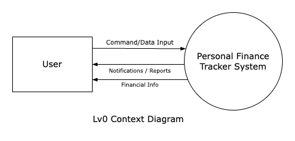
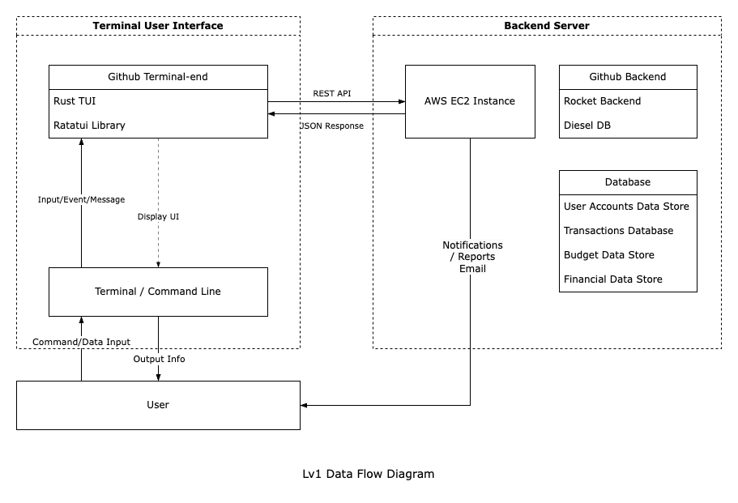

# Team Information
Contributors to this project are:
* Ke Li (1005842554)
* Ellen Pan (1002159353)
* Sarah Tang (1002397079)

# Motivation
In today’s fast-paced world, financial management is crucial for individuals seeking to maintain control over their income and expenses. However, although there are various finance related apis and accounting tools available in existing Rust crates, there lacks a centralized tool for users to organize the information, track their spending habits, as well as analyzing their personal expenses. To address this gap, we proposed developing a robust, user-friendly personal finance tracker `FIRE` using Rust, tailored for users looking for a simplified yet powerful tool to handle their financial management effectively.

This project aims to deliver a versatile text user interface solution designed to empower users with seamless tracking of income and expenses across customizable categories, while managing multiple account types upon users’ needs. The tool ensures accurate financial data logging and automated reconciliation, delivering a streamlined experience for users seeking clear insights into their spending, saving, and investment behavior. Featuring an intuitive, no-frills interface, this utility enables users to optimize their financial strategies and decision-making, to reach long-term financial goals and, eventually, achieve FIRE (Financial Independence, Retire Early).

# Scope Definition
This section entails the scope of our project, which includes objectives of the `FIRE` tool and the details for various features of our tool. Please note that, because of the time constraint and limited resources, our tool would only support text user interface (TUI).

## Objectives
The goal of FIRE (personal finance tracker) is to provide users with a streamlined, TUI-based tool that empower users to take full control of their personal finances with ease and precision. Built with Rust, this tool will simplify financial management by enabling users to log transactions, set and monitor budgets, and generate insightful financial reports. Key objectives include:

1. **Intuitive Budgeting Tools**

Users can access easy-to-use text user interface to set spending limits in categories like housing, utilities, and entertainment, as well as income expectations, such as salary or bonuses. By allowing budgets to be managed daily, weekly, monthly, or yearly, the tool lets users adjust tracking to fit their personal needs. With real-time updates on spending, users can continuously monitor their progress and stay aligned with their financial goals.

2. **Comprehensive Financial Reports**

Users can access customizable reports that provide clear insights into their spending and saving habits. These reports are available in different views—such as account-based, income-focused, or expense-oriented—and can be adjusted by time frame, ranging from daily to yearly. Additionally, the tool offers budget status summaries (below target, on target, or exceeded) to show users how well they’re meeting their financial goals.

## Key Features
In this section, we identify the functions for our personal finance tracker to support the above objectives. The functionalities are categorized with detailed descriptions. The actual text user interface for each functionality would be included later, as implementation progresses.

### User Authentication
The tool must support user authentication for access control and account interactions. Specifically:
* When the user uses the tool for the first time, he/she would be prompted to enter a username and a password.
* Usernames must be unique. The tool would provide error messages in case of a collision in usernames.
* On subsequent tool usage, the tool would authenticate the user through the username and password.

### Account Management
There are two types of functionalities relevant to account management:
* The tool must support users to add, delete, and rename different accounts. 
   * The account names should be unique for the same user. The tool would provide error messages in case of a collision in names when adding or renaming accounts.
* The tool must support multiple types of accounts for each user. The types are defined in two levels:
  1. On the basic level, the accounts are divided into debit and credit accounts.
  2. On the finer-grind level, the user could customize the account names based on their own needs.

### Transaction Management
Before we dive into detailed functionalities, we would like to make a distinction between **internal** and **external** transactions for a user:
* An **internal** transaction is one that happens among multiple accounts of the same user. In this case, the user should use the “transfer” function. 
* All other transactions are considered **external**. In this case, the user should use the “log” function.
For each logged transaction, the tool would provide a transaction_id to the user.

In terms of functionalities, the tool must support users to log their transactions and categorize them. More specifically:
* The user should define a transaction as either income or expense.
* The user should be able to classify a transaction with one or more categories.
  * The tool provides default lists of categories for both income and expenses, listed below:
  * Income default categories: wage/bonus/interest/investment
  * Expense default categories: utility/housing/shopping/food/grocery/car
* The user should be able to add customized categories.
* Optionally, the user could specify notes with each transaction.
* The user should be able to modify a logged transaction’s amount, involved accounts, categories, and notes if applicable.

### Budget Management
The tool must support users to manage budgets. Specifically, the user should be able to:
* Set numerical limits for expense categories.
* Set numerical expectations for income categories.
* Set frequency for budgets: daily/weekly/monthly/yearly.
* Modify previously set budgets.
The specified categories and frequencies would be validated by the tool.

As an advanced feature, the user could sign-up for email warnings when the spending comes close to the set budgets. The sign-up option is available when creating limits, and users should provide their email addresses. 

### Analysis and Reporting
On the basic level, the tool must offer reports on the logged transactions:
* The user could choose between two views: account centric, income centric, or expense.
* The user could adjust the time span of the reports: daily/weekly/monthly/yearly.
* The user could get budget status: below_expectation/on_target/exceeded.

As an advanced feature, the user could sign-up for email notifications to receive regular reporting and analysis. The settings for the email notifications would be the same as the above, but users should provide their email addresses. 

# Tentative Plan
## System Overview
This section presents a high level overview of our personal finance tracker. A data flow diagram of the system, together with the potential technologies to be used, would be provided.

### Data Flow Diagram
On the high level, users provide transaction and account information to our tool and get insights into logged and stored information in return. The Level 0 Data Flow Diagram is shown below. 

A more detailed data flow diagram for the TUI is shown below. Our tool provides a frontend that receives text commands from users and relays the information to a backend with persistent storage.

### Potential Technologies
This section suggests potential external crates we would use to help with the implementation of our FIRE tool.

#### TUI tool: `ratatui`
`Ratatui` provides a flexible framework for designing customizable TUI layouts. This flexibility can be beneficial for our project which requires layout management and data presentation like financial tracking dashboards.

#### Backend: `Rocket`
`Rocket` is a more straightforward and intuitive API for developers who are new to Rust to learn and use. Its design allows developers to get started quickly and write more readable code with less hustle. 

#### DataBase: `Diesel`
`Diesel` is pretty mature in the Rust ecosystem which makes it more stable and keeps a high reliability. Also, it has well-maintained documentation and an active community, making it easier to get started and particularly helpful for developers who may be new to Rust.

#### Email Report: `Lettre`
The `Lettre` crate is an email library for Rust that supports sending automated emails, such as weekly or monthly reports and notifications. It provides support for SMTP and other transport methods, enabling efficient integration of email functionalities with minimal setup.

### Backend Deployment: AWS EC2
AWS EC2 is a scalable cloud computing service that provides cloud servers to run applications. In our financial tracker project, AWS EC2 serves as the backend deployment platform. By leveraging EC2, we can ensure the application backend is resilient, responsive and capable of scaling to meet user demands.

## Work Distribution
With the above highlevel system design, we intend to modularize our tool into smaller services so that work could be parallelized as much as possible, once the interfaces between components could be settled. Each module should be implemented and tested individually, and the team would come together at the end to put the "puzzle pieces" together. Our tenative work distribution and internal timeline are summarized in the table below:  
| Tentative Completion Date | Task                                                                                                                                   | Assignee                 |
|---------------------------|----------------------------------------------------------------------------------------------------------------------------------------|--------------------------|
| 2024/11/15                | Interface discussion: TUI and backend logic                                                                                            | Ellen Pan Sarah Tang     |
|                           | Interface discussion: backend logic and database                                                                                       | Ke Li Sarah Tang         |
| 2024/11/25                | Complete TUI design and functionalities                                                                                                | Ellen Pan                |
|                           | Complete backend logic                                                                                                                 | Sarah Tang               |
|                           | Complete database storage and interface for database                                                                                   | Ke Li                    |
| 2024/11/30                | Combine the modules together and integration test                                                                                      | All members of the team. |
| 2024/12/10                | All deliverables completed: <ul> <li> Source code repository done </li> <li> Demo recorded </li> <li> README.md up-to-date </li> </ul> | All members of the team. |

